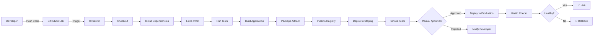
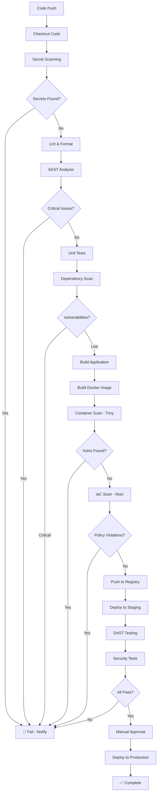
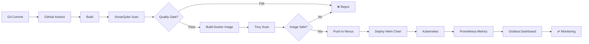
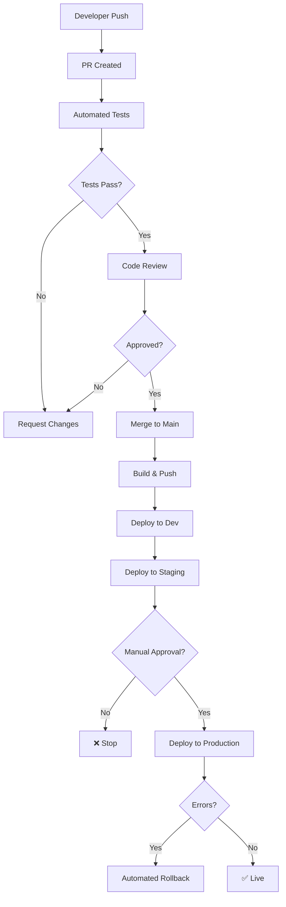
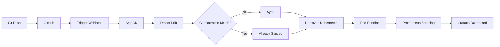
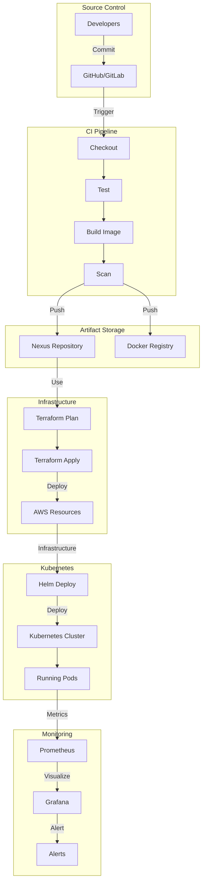

# CI/CD Pipeline Examples

## 📚 Official Documentation

- [GitHub Actions](https://docs.github.com/en/actions)
- [GitLab CI/CD](https://docs.gitlab.com/ee/ci/)
- [Jenkins](https://www.jenkins.io/doc/)
- [GitOps Best Practices](https://opengitops.dev/)

---

## 🏗️ Architecture Diagrams

### 1. Basic Web App Pipeline Architecture



**Flow:**
1. Developer pushes code to GitHub/GitLab
2. Webhook triggers CI/CD pipeline
3. Code checkout and dependency installation
4. Code quality checks (linting, formatting)
5. Unit tests execution
6. Build application
7. Package as artifact/Docker image
8. Push to artifact registry
9. Deploy to staging environment
10. Run smoke tests
11. Manual approval for production
12. Deploy to production
13. Health checks and verification
14. Rollback if needed

---

### 2. DevSecOps Pipeline with Security Scanning



**Security Stages:**
1. **Secret Scanning**: Detect API keys, passwords
2. **SAST**: Static Application Security Testing
3. **Dependency Scanning**: Vulnerable packages
4. **Container Scanning**: OS vulnerabilities (Trivy)
5. **IaC Scanning**: Infrastructure misconfigurations (tfsec)
6. **DAST**: Dynamic testing in staging
7. **Compliance**: Policy enforcement

---

### 3. CI/CD with SonarQube, Nexus, and Kubernetes



---

### 4. Multi-Environment Pipeline



---

### 5. GitOps Pipeline with ArgoCD



---

### 6. Complete DevOps Pipeline with Terraform & Kubernetes



---

## 📋 Basic Web App Pipeline

```
checkout -> install -> lint -> test -> build -> package -> deploy
```

**Detailed:**
1. **Checkout**: Clone repository
2. **Install**: Install dependencies (npm, pip, maven, etc.)
3. **Lint**: Check code style and format
4. **Test**: Run unit tests
5. **Build**: Compile/build application
6. **Package**: Create artifact (JAR, Docker image, etc.)
7. **Deploy**: Push to production

---

## 🔒 DevSecOps Pipeline

```
checkout -> secret scan -> lint -> test -> SAST -> dependency scan -> container build -> image scan -> IaC scan -> deploy -> smoke test
```

**Security Checks:**
- **Secret Scan**: Detect exposed API keys
- **Lint**: Code quality and standards
- **Test**: Unit and integration tests
- **SAST**: Static code analysis (SonarQube)
- **Dependency Scan**: Vulnerable packages (Mend, Snyk)
- **Image Scan**: Container vulnerabilities (Trivy)
- **IaC Scan**: Infrastructure misconfigurations (tfsec, Checkov)
- **Smoke Tests**: Quick functionality verification

---

## 🤖 MLOps Pipeline

```
data validation -> train -> evaluate -> register model -> build serving image -> deploy -> monitor drift
```

**ML-Specific Stages:**
1. **Data Validation**: Check data quality and schema
2. **Train**: Train ML model
3. **Evaluate**: Test model performance
4. **Register Model**: Save to model registry (MLflow)
5. **Build Serving Image**: Containerize model
6. **Deploy**: Deploy to serving platform
7. **Monitor Drift**: Track model performance over time

---

## ✅ GitHub Actions Beginner Checklist

- ✅ Use least privilege permissions for tokens
- ✅ Store secrets in GitHub Secrets
- ✅ Cache dependencies to speed up builds
- ✅ Upload artifacts when needed
- ✅ Fail fast on tests and scans
- ✅ Keep deployment manual until team understands
- ✅ Document pipeline flow
- ✅ Use branch protection rules
- ✅ Require PR reviews
- ✅ Monitor workflow costs

---

## 🔄 Pipeline Patterns

### Blue-Green Deployment
```
Version A (Blue) ← Load Balancer → Version B (Green)
Run both, switch traffic instantly
```

### Canary Deployment
```
Production (95%) ← Load Balancer → Canary (5%)
Gradually increase traffic to new version
```

### Rolling Deployment
```
Gradually replace old pods with new ones
Maintains availability, slower rollout
```

### Shadow Deployment
```
Run new version alongside production
Capture traffic, but don't use responses
Safe testing in production
```

---

## 📝 Interview Questions

Be ready to explain:

1. **What triggers the pipeline?**
   - Push to main/develop branch
   - Pull request creation
   - Scheduled (cron job)
   - Manual trigger (webhook)

2. **What happens when a test fails?**
   - Pipeline stops (fail-fast)
   - Notification sent (email, Slack, Teams)
   - PR blocked from merge
   - Developer notified immediately

3. **Where are artifacts stored?**
   - Docker images: Registry (DockerHub, ECR, Nexus)
   - Binaries: Nexus, Artifactory, S3
   - Terraform: Remote state (S3, Terraform Cloud)
   - Models: Model registry (MLflow, SageMaker)

4. **How are secrets protected?**
   - Never in code or config files
   - Stored in secret manager (GitHub Secrets, Vault, AWS Secrets Manager)
   - Masked in logs
   - Rotated regularly
   - Access controlled

5. **How do you roll back?**
   - Keep previous version running
   - Switch traffic back quickly
   - Database migrations must be reversible
   - Document rollback procedure
   - Practice rollback regularly

6. **What's your deployment frequency?**
   - Beginners: Weekly or monthly
   - Intermediate: Daily
   - Advanced: Multiple times per day (CD)

7. **How do you handle database migrations?**
   - Backward compatible changes
   - Blue-green with separate DBs
   - Rollback procedure documented
   - Test in staging first

8. **What monitoring do you have?**
   - Application metrics (Prometheus)
   - Logs (ELK, Loki)
   - Traces (Jaeger, Tempo)
   - Alerts (AlertManager, PagerDuty)
   - SLO/SLI tracking

---

## 🔗 Example Pipeline Tools

| Tool | Type | Best For |
|------|------|----------|
| **GitHub Actions** | Hosted CI/CD | GitHub repos, cloud-native |
| **GitLab CI/CD** | Hosted CI/CD | GitLab repos, Kubernetes |
| **Jenkins** | Self-hosted | Complex on-prem pipelines |
| **CircleCI** | Hosted CI/CD | Startups, quick setup |
| **ArgoCD** | GitOps | Kubernetes deployments |
| **Terraform Cloud** | Infrastructure | IaC management |
| **CloudFormation** | Infrastructure | AWS-only |

---

## 📖 References

- [GitHub Actions Docs](https://docs.github.com/en/actions)
- [GitLab CI/CD Docs](https://docs.gitlab.com/ee/ci/)
- [Jenkins Documentation](https://www.jenkins.io/doc/)
- [ArgoCD Documentation](https://argo-cd.readthedocs.io/)
- [CI/CD Best Practices](https://12factor.net/)


