# Original Architecture Diagrams For Submitted CloudAdhar Topics

These diagrams are CloudAdhar learning visuals created for this repository. Use them with the detailed study guides to understand the architecture, workflow, and implementation sequence for each module.

Source map: [CloudAdhar Learning Map](../cloudadhar-learning-map.md)

Detailed guides:

- [Agentic AI and RAG](agentic-ai-and-rag.md)
- [DevOps Foundations and Automation](devops-foundations-and-automation.md)
- [Cloud CI/CD and Security](cloud-cicd-and-security.md)
- [Git GitHub and CI Debugging](git-github-ci-debugging.md)

## Agentic AI, RAG, And Local AI

### 1. Local AI Agent With Tool Calling And Memory

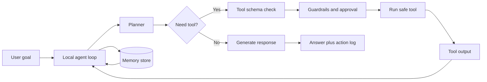

Learner build flow:

1. Start with one safe tool.
2. Add memory only for useful non-secret facts.
3. Log tool call, input, output, and final answer.
4. Add approval before write, delete, deploy, or command execution.

### 2. Private RAG Q&A Agent For Documents

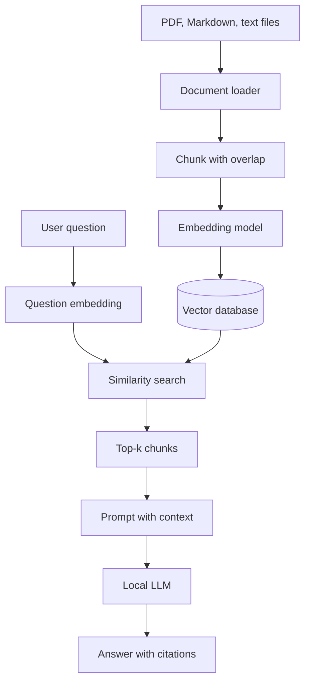

Learner build flow:

1. Load private documents.
2. Split into chunks.
3. Embed chunks and store vectors.
4. Retrieve top matches for each question.
5. Generate grounded answers with source names.

### 3. Switchback Experiments For AI Platform Features

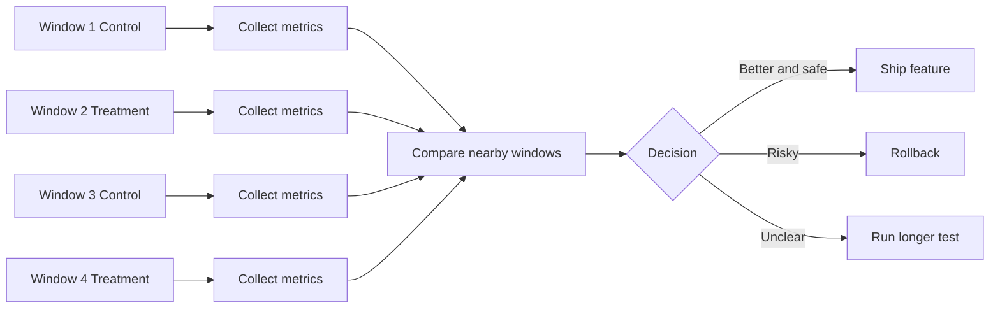

Learner build flow:

1. Define treatment and control behavior.
2. Alternate behavior by time window.
3. Track primary and guardrail metrics.
4. Compare nearby windows before deciding.

### 4. AI Agent That Runs LLM Experiments

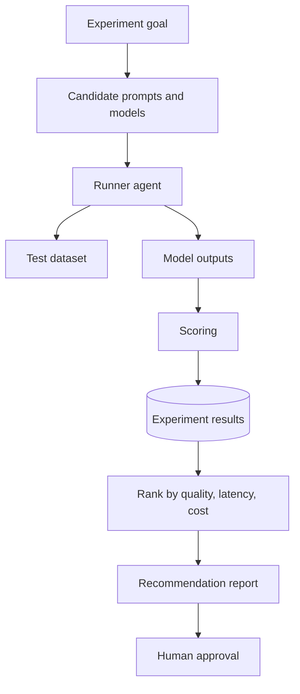

Learner build flow:

1. Create test questions.
2. Run prompt and model combinations.
3. Score quality, citations, latency, and cost.
4. Pick a winner with evidence.

### 5. AI-Powered Local-First Chrome Extension

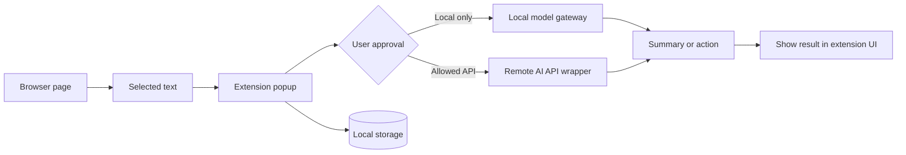

Learner build flow:

1. Define extension permissions.
2. Store settings locally.
3. Ask before sending page content anywhere.
4. Handle local model unavailable errors.

### 6. Agentic Terminal Workflow With GitHub Copilot CLI And MCP Servers

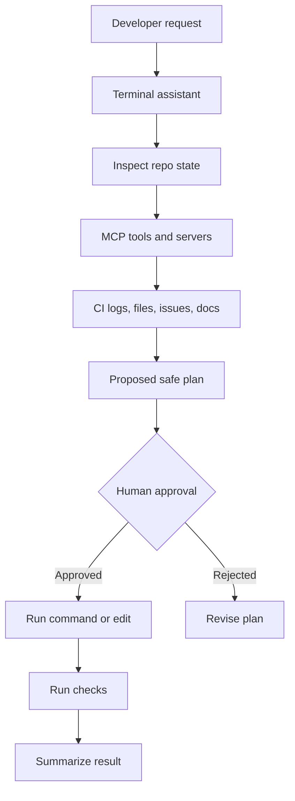

Learner build flow:

1. Inspect before acting.
2. Use tools with limited permissions.
3. Ask approval for risky actions.
4. Verify and summarize.

## DevOps Foundations And Automation

### 7. Bash And Python For Real DevOps Automation

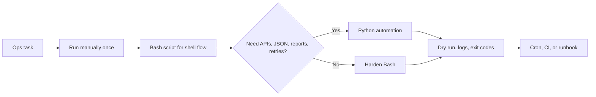

### 8. Common DevOps Mistakes And Prevention

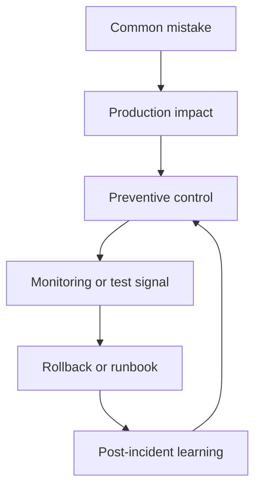

### 9. Foundation Map For Hardware, Cloud, DevOps, Networking, Security, Databases, DNS, Git, And Linux

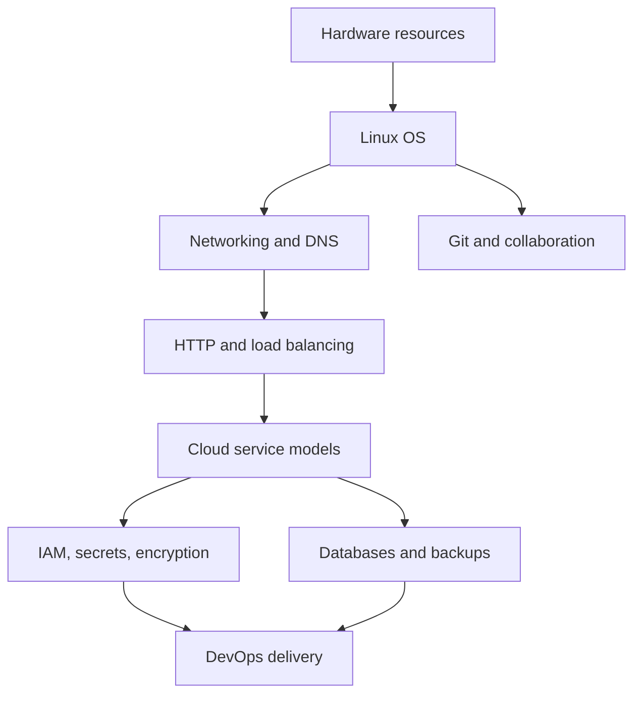

### 10. How DevOps Works

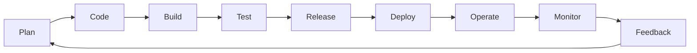

### 11. DevTestOps Flow

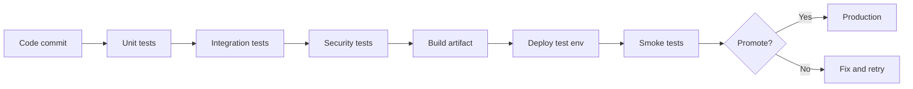

### 12. Beginner DevOps Engineering Path

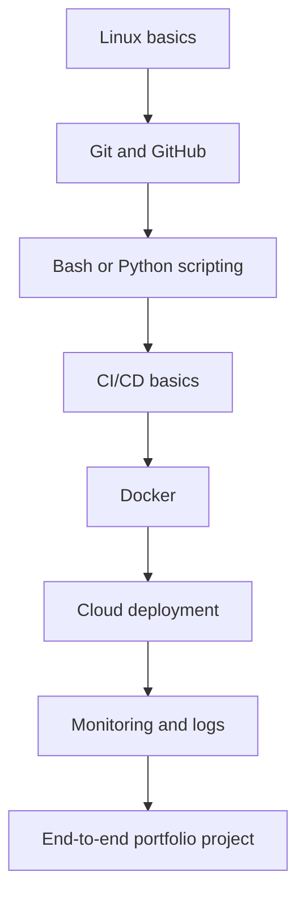

### 13. DevOps Prerequisites Path

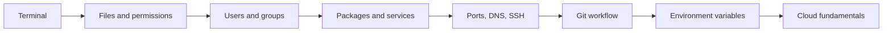

### 14. Frontend DevOps Automation

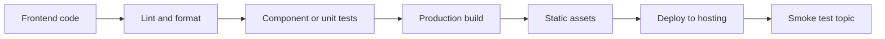

## Cloud, CI/CD, Security, And Platforms

### 15. Azure Repositories At Scale

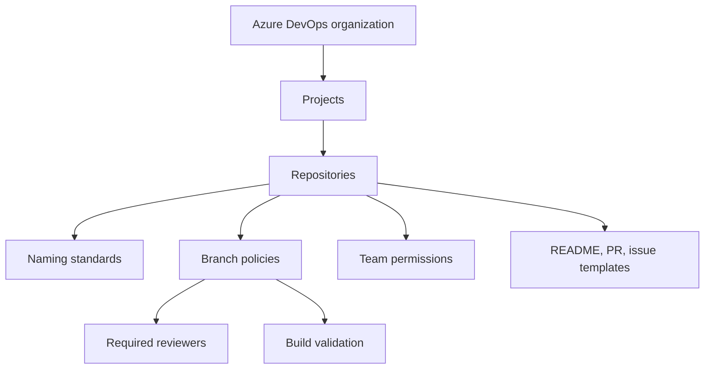

### 16. Azure DevOps Enterprise CI/CD

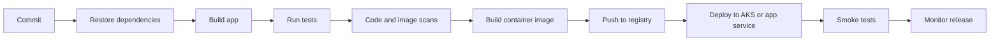

### 17. Production-Ready DevOps Pipeline With Free Tools

```mermaid
flowchart LR
    PR[Pull request] --> Lint
    Lint --> Tests
    Tests --> SecretScan[Secret scan]
    SecretScan --> DepScan[Dependency scan]
    DepScan --> DockerBuild[Docker build]
    DockerBuild --> ImageScan[Image scan]
    ImageScan --> DeployTest[Deploy test]
    DeployTest --> Smoke[Smoke test]
    Smoke --> Promote[Promote with approval]
```

### 18. Feature Flags And RBAC In DevOps

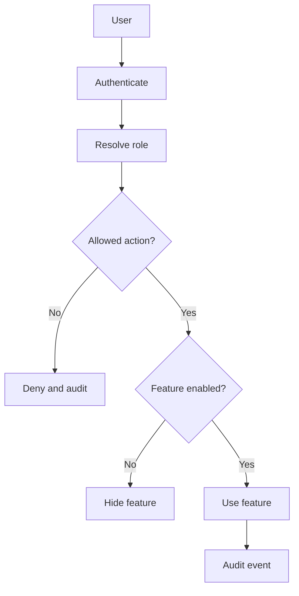

### 19. AWS Basics For DevOps

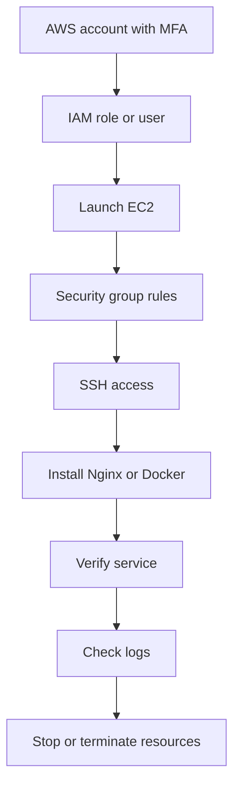

### 20. Local DevOps Homelab With Docker, Kubernetes, And Ansible

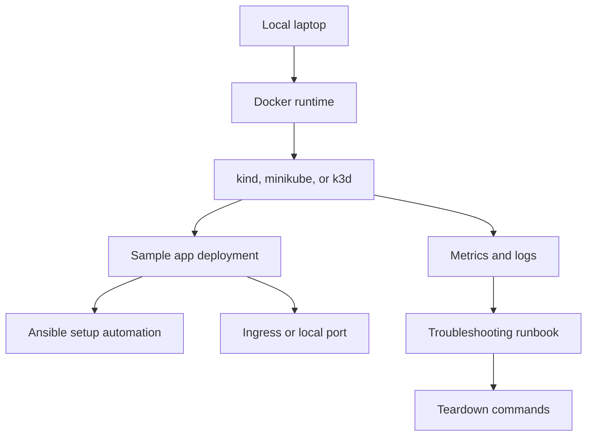

### 21. DevOps With GitLab CI

```mermaid
flowchart LR
    Push[Git push] --> GitLab[GitLab CI]
    GitLab --> Runner[Runner picks job]
    Runner --> Build
    Build --> Test
    Test --> Package
    Package --> Artifacts[Artifacts and reports]
    Artifacts --> Deploy[Deploy job]
    Deploy --> Manual[Manual approval if needed]
```

### 22. Next.js On Cloudflare Workers With GitHub Actions

```mermaid
flowchart LR
    Code[Next.js code] --> GitHub[GitHub repo]
    GitHub --> Actions[GitHub Actions]
    Actions --> Install[Install dependencies]
    Install --> Build[Build for Cloudflare runtime]
    Build --> Secrets[Use deployment secrets]
    Secrets --> Cloudflare[Deploy to Cloudflare Workers]
    Cloudflare --> topic[Preview or production topic]
    topic --> Verify[Verify routes and logs]
```

### 23. OIDC In GitHub Actions For AWS

```mermaid
sequenceDiagram
    participant GH as GitHub Actions
    participant OIDC as GitHub OIDC Provider
    participant AWS as AWS STS
    participant IAM as IAM Role
    participant SVC as AWS Service
    GH->>OIDC: Request OIDC token
    OIDC-->>GH: Signed identity token
    GH->>AWS: Assume role with token
    AWS->>IAM: Validate trust policy
    IAM-->>AWS: Allow scoped session
    AWS-->>GH: Temporary credentials
    GH->>SVC: Run allowed deployment action
```

## Git, GitHub, And CI Debugging

### 24. Fix Failing GitHub PR CI

```mermaid
flowchart TD
    PR[Pull request] --> Fail[Failing check]
    Fail --> Logs[Open job logs]
    Logs --> FirstError[Find first real error]
    FirstError --> Reproduce[Run same command locally]
    Reproduce --> Fix[Make smallest fix]
    Fix --> LocalCheck[Run local check]
    LocalCheck --> Push[Push commit]
    Push --> CI[CI reruns]
    CI --> Summary[Write root cause summary]
```

### 25. Git And GitHub Crash Course

```mermaid
flowchart LR
    Init[git init or clone] --> Status[git status]
    Status --> Add[git add]
    Add --> Commit[git commit]
    Commit --> Branch[git branch]
    Branch --> Push[git push]
    Push --> PR[Open pull request]
    PR --> Review[Review and merge]
    Review --> Pull[git pull latest]
```

### 26. Git And GitHub Beginner Handbook

```mermaid
flowchart TD
    Main[Main branch] --> FeatureA[Developer A branch]
    Main --> FeatureB[Developer B branch]
    FeatureA --> PRA[Pull request A]
    FeatureB --> PRB[Pull request B]
    PRA --> ReviewA[Code review]
    PRB --> ReviewB[Code review]
    ReviewA --> MergeA[Merge]
    ReviewB --> Conflict{Conflict?}
    Conflict -->|Yes| Resolve[Resolve conflict]
    Conflict -->|No| MergeB[Merge]
    Resolve --> MergeB
```

## Portfolio Rule

For each diagram, learners should add their own:

1. Screenshot of implementation.
2. Commands used.
3. Logs or pipeline output.
4. Errors faced and fixes.
5. Interview explanation in 5 to 8 bullet points.
