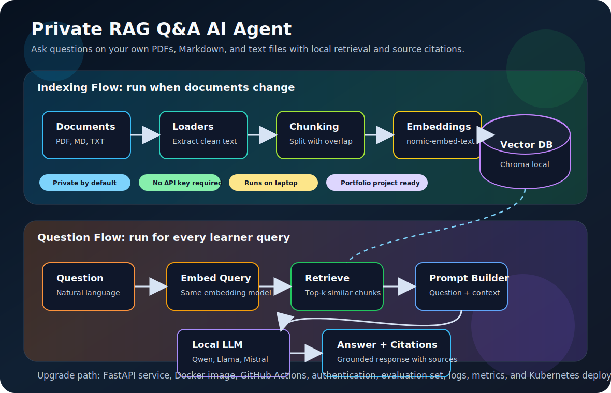

# Private RAG Q&A AI Agent

Build a local AI assistant that answers questions from your own PDFs, Markdown files, and text notes. This is a portfolio-ready Agentic AI and MLOps project because it includes document ingestion, embeddings, vector search, local model serving, citations, and a clear production upgrade path.



## What You Will Build

You will create a private Retrieval-Augmented Generation system that runs on your machine:

1. Load documents from a local folder.
2. Convert PDFs, Markdown, and text files into clean text.
3. Split content into overlapping chunks.
4. Create embeddings with a local Ollama embedding model.
5. Store vectors in a local Chroma database.
6. Retrieve the most relevant chunks for each question.
7. Ask a local chat model to answer only from retrieved context.
8. Print the answer with source file citations.

## Why This Project Matters

This project teaches the core flow used inside document chatbots, internal knowledge assistants, support copilots, research assistants, compliance search, and enterprise AI portals. A learner can explain it in interviews as a complete AI system instead of saying only "I used ChatGPT."

## Tech Stack

| Layer | Tool | Why It Is Used |
| --- | --- | --- |
| Language | Python | Simple ecosystem for AI, data, APIs, and automation |
| Agent framework | LangChain | Agent harness, model abstraction, middleware, and retrieval building blocks |
| Local model runtime | Ollama | Runs chat and embedding models locally |
| Chat model | Qwen, Llama, or Mistral | Generates answers from retrieved context |
| Embedding model | nomic-embed-text | Converts documents and questions into vectors |
| Vector database | Chroma | Stores embeddings and performs similarity search |
| Document parsing | pypdf | Extracts text from PDF files |

## Quick Start

Install Ollama first from the official download page, then pull one chat model and one embedding model:

```bash
ollama pull qwen3:4b
ollama pull nomic-embed-text
```

Create a virtual environment and install Python dependencies:

```bash
cd projects/private-rag-qa-agent
python3 -m venv .venv
source .venv/bin/activate
pip install -r requirements.txt
```

Add your own documents:

```bash
cp ~/Downloads/*.pdf documents/
cp ~/notes/*.md documents/
```

Run the agent:

```bash
python qa_agent.py --reindex
```

Ask questions in plain English:

```text
You: What are the main steps in our Kubernetes deployment notes?
You: Which file explains Prometheus alerting?
You: Summarize the certification plan from my study documents.
```

Use `exit` to stop.

## How The Architecture Works

### Indexing Phase

Indexing runs when documents are added or changed.

| Step | What Happens |
| --- | --- |
| Load | The script scans the `documents/` folder for `.pdf`, `.md`, and `.txt` files. |
| Parse | Text is extracted and each document keeps source metadata. |
| Split | Long content is split into chunks with overlap so ideas are not broken badly. |
| Embed | Each chunk is converted into a vector using the local embedding model. |
| Store | Chroma saves vectors and metadata in `chroma_db/` for reuse. |

### Query Phase

The query flow runs every time a learner asks a question.

| Step | What Happens |
| --- | --- |
| Question | The learner asks a natural language question. |
| Retrieve | The vector database finds top matching document chunks. |
| Augment | The retrieved text is added to the model context. |
| Generate | The local chat model answers from that context. |
| Cite | The script prints the source files used for the answer. |

## Useful Commands

Rebuild the index after adding documents:

```bash
python qa_agent.py --reindex
```

Use a smaller model for a low-memory laptop:

```bash
ollama pull qwen3:1.7b
python qa_agent.py --chat-model qwen3:1.7b
```

Retrieve more chunks when answers feel incomplete:

```bash
python qa_agent.py --k 8
```

Use smaller chunks for focused answers:

```bash
python qa_agent.py --chunk-size 700 --chunk-overlap 120 --reindex
```

## Folder Structure

```text
private-rag-qa-agent/
├── README.md
├── qa_agent.py
├── requirements.txt
├── documents/
│   └── .gitkeep
└── chroma_db/          # generated locally, ignored by git
```

## Production Upgrade Path

Turn this into an advanced DevOps plus AI project:

| Upgrade | What To Add |
| --- | --- |
| API | Wrap the agent with FastAPI and expose `/ask`, `/health`, and `/reindex`. |
| UI | Build a React or Streamlit frontend for uploads and chat history. |
| Docker | Package Ollama, API, and app dependencies using containers. |
| CI/CD | Add GitHub Actions for linting, security scan, image build, and deployment. |
| Cloud | Store documents in S3, Azure Blob Storage, or Google Cloud Storage. |
| Security | Add auth, file size limits, malware scanning, and private network access. |
| Observability | Log latency, retrieved sources, token usage, errors, and answer quality. |
| Evaluation | Maintain golden questions and check answer faithfulness after changes. |
| Kubernetes | Deploy API and UI, then expose through Nginx or Kong Gateway. |

## Interview Talking Points

1. Why RAG is different from fine-tuning.
2. Why chunk size and chunk overlap affect answer quality.
3. Why the same embedding model must be used for documents and questions.
4. How vector similarity search finds relevant content.
5. Why citations make AI answers more trustworthy.
6. What happens when the answer is not present in the documents.
7. How you would secure document upload in production.
8. How you would monitor hallucination, latency, and retrieval quality.
9. How to move from local Chroma to a managed vector database.
10. How to deploy this on Kubernetes behind Nginx or Kong.

## Common Issues

| Problem | Fix |
| --- | --- |
| `ollama: command not found` | Install Ollama and restart the terminal. |
| Model not found | Run `ollama pull qwen3:4b` and `ollama pull nomic-embed-text`. |
| No documents found | Add `.pdf`, `.md`, or `.txt` files inside `documents/`. |
| Old answers after adding files | Run with `--reindex` to rebuild Chroma. |
| Laptop is slow | Use a smaller chat model and reduce `--k`. |
| Answers are too generic | Increase `--k`, tune chunk size, and improve source documents. |

## Learner Assignment

Build this project in three levels:

| Level | Deliverable |
| --- | --- |
| Beginner | Run locally with your own notes and show cited answers. |
| Intermediate | Add FastAPI endpoints and Dockerfile. |
| Advanced | Add GitHub Actions, authentication, Prometheus metrics, and Kubernetes manifests. |

## References

- [LangChain Agents documentation](https://docs.langchain.com/oss/python/langchain/agents)
- [LangChain Chroma integration](https://docs.langchain.com/oss/python/integrations/vectorstores/chroma)
- [LangChain Ollama provider docs](https://docs.langchain.com/oss/python/integrations/providers/ollama)
- [Ollama download](https://ollama.com/download)
- [Ollama nomic-embed-text model](https://ollama.com/library/nomic-embed-text)
- [freeCodeCamp private RAG Q&A article](https://www.freecodecamp.org/news/build-a-private-rag-qa-ai-agent-for-your-documents-using-langchain/)
